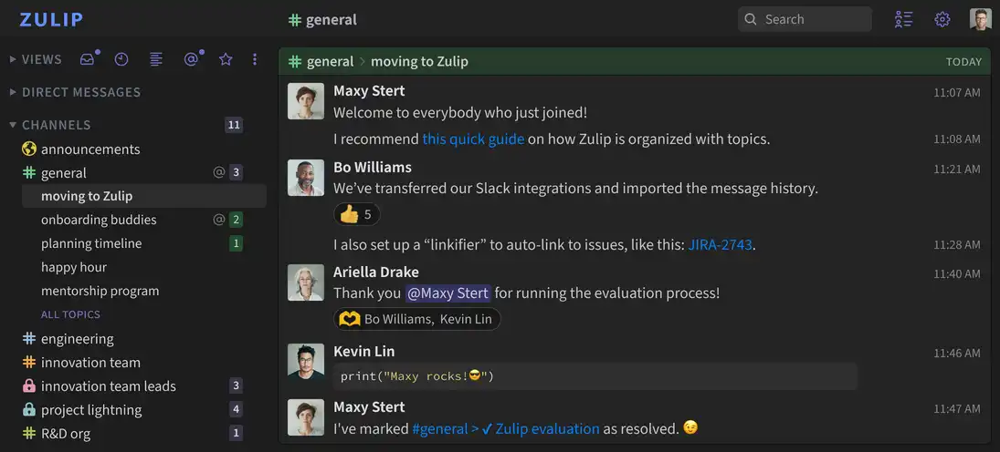

<!--
N.B.: README ini dibuat secara otomatis oleh <https://github.com/YunoHost/apps/tree/master/tools/readme_generator>
Ini TIDAK boleh diedit dengan tangan.
-->

# Zulip untuk YunoHost

[](https://ci-apps.yunohost.org/ci/apps/zulip/)  

[](https://install-app.yunohost.org/?app=zulip)

*[Baca README ini dengan bahasa yang lain.](./ALL_README.md)*

> *Paket ini memperbolehkan Anda untuk memasang Zulip secara cepat dan mudah pada server YunoHost.*  
> *Bila Anda tidak mempunyai YunoHost, silakan berkonsultasi dengan [panduan](https://yunohost.org/install) untuk mempelajari bagaimana untuk memasangnya.*

## Ringkasan

Zulip is an open-source team collaboration tool with unique topic-based threading that combines the best of email and chat to make remote work productive and delightful. Zulip is the only modern team chat app that is designed for both live and asynchronous conversations.

**Versi terkirim:** 9.2~ynh1

## Tangkapan Layar



## Dokumentasi dan sumber daya

- Website aplikasi resmi: <https://zulip.com/>
- Dokumentasi admin resmi: <https://zulip.readthedocs.io/>
- Depot kode aplikasi hulu: <https://github.com/zulip/zulip>
- Gudang YunoHost: <https://apps.yunohost.org/app/zulip>
- Laporkan bug: <https://github.com/YunoHost-Apps/zulip_ynh/issues>

## Info developer

Silakan kirim pull request ke [`testing` branch](https://github.com/YunoHost-Apps/zulip_ynh/tree/testing).

Untuk mencoba branch `testing`, silakan dilanjutkan seperti:

```bash
sudo yunohost app install https://github.com/YunoHost-Apps/zulip_ynh/tree/testing --debug
atau
sudo yunohost app upgrade zulip -u https://github.com/YunoHost-Apps/zulip_ynh/tree/testing --debug
```

**Info lebih lanjut mengenai pemaketan aplikasi:** <https://yunohost.org/packaging_apps>
